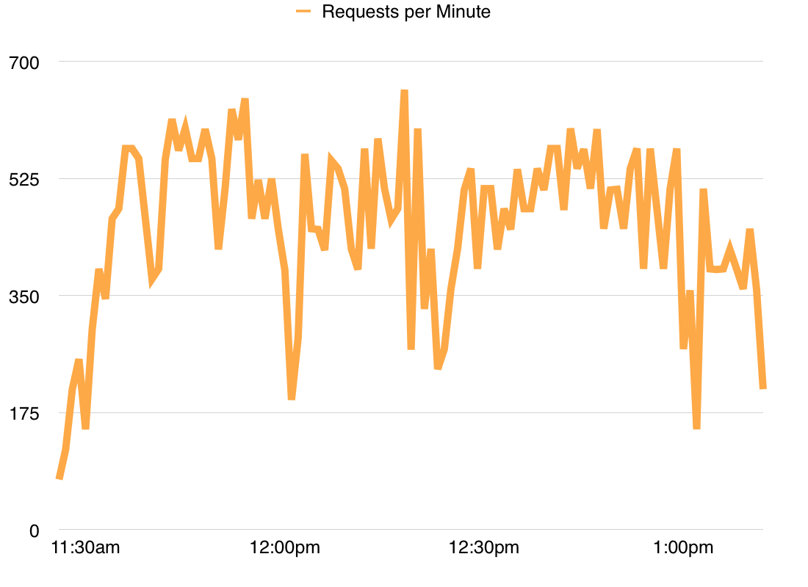
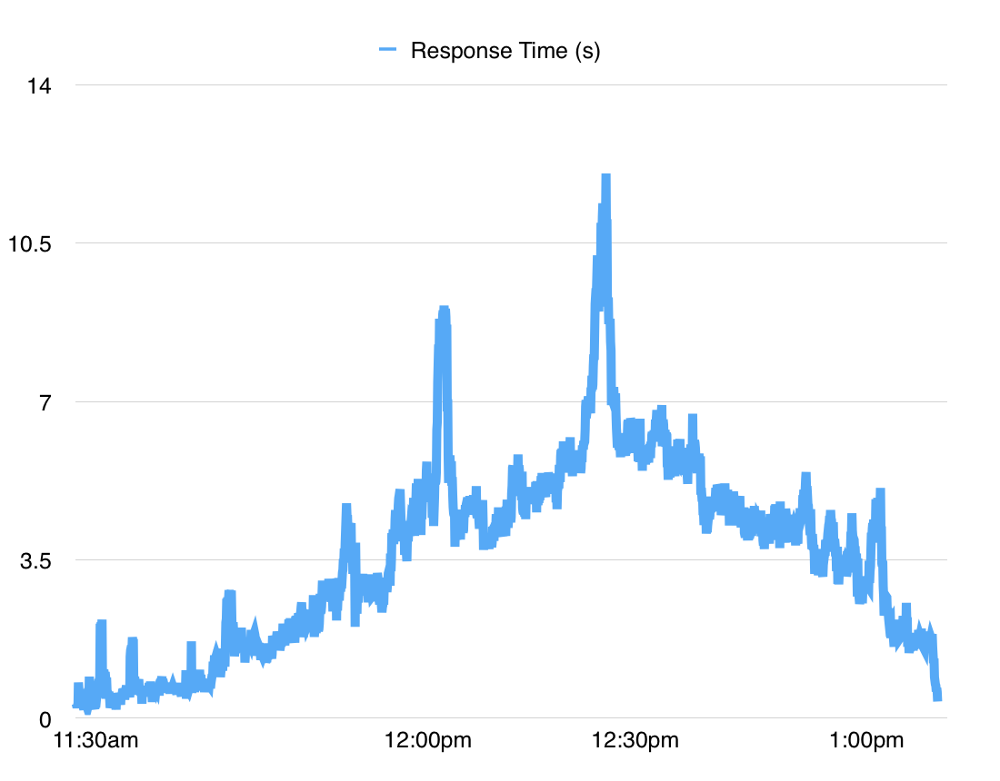
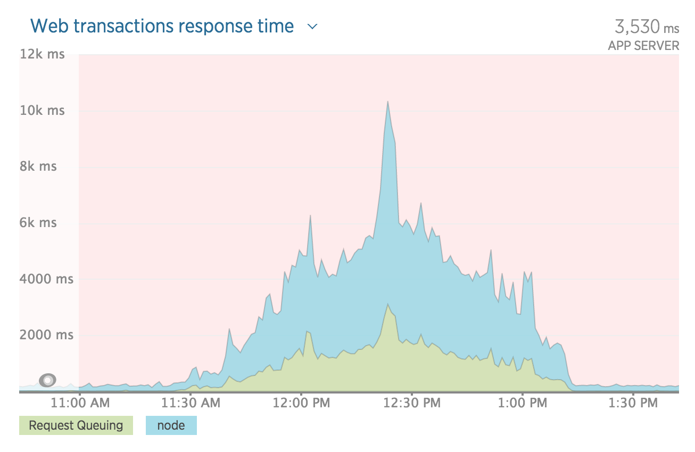
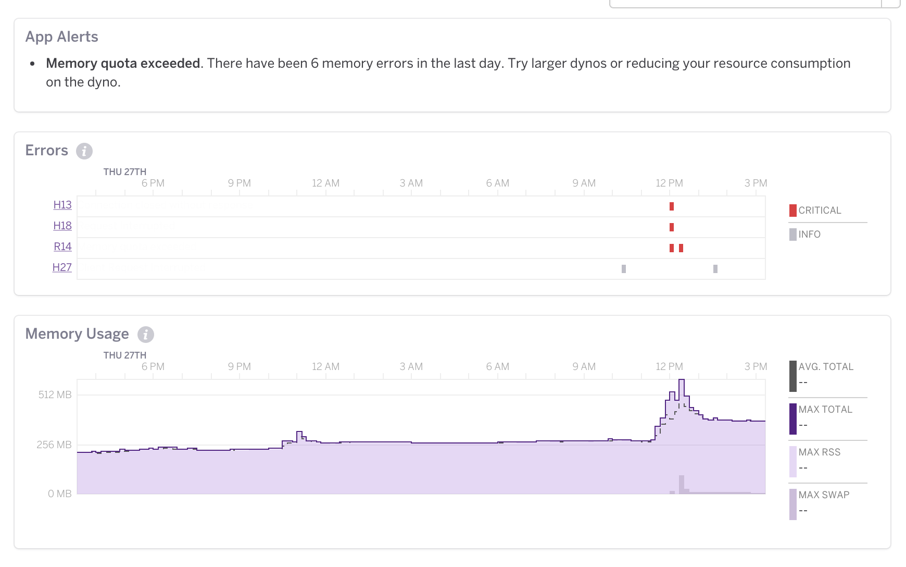
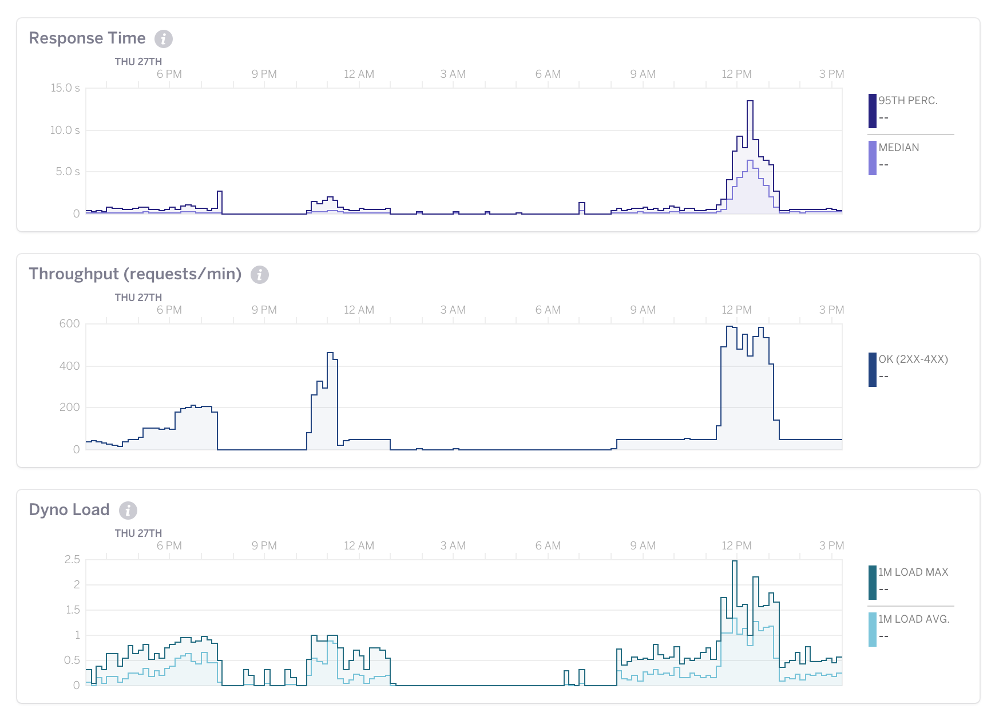

# Open Aerial Map Performance Testing:  Open Aerial Map Catalog

## Introduction

Open Aerial Map(OAM) is made up of a collection of tools and services with the primary purpose of making openly licensed imagery easy to find and use. 

This report details performance and load testing completed in August 2015 to assess the limits of the OAM Catalog service that provides OAM's search capability. 

## Scope and Objectives

Several objectives were defined including:

1. Test OAM Catalog's `/meta` endpoint using:  
	* bounding-box queries
	* filtering methods
2. Assess overall capacity of a single standard Heroku dyno.
3. Assess whether MongoDB is a bottleneck.
4. Publish all test scripts and tools created to an OAM repository.
5. Test OAM server upload capability.
6. Produce a report detailing all findings.

Unfortunately, objective five was not completed because the OAM server upload capability was not available.

Open Aerial Map is quite new and as such, has not large amounts of traffic. During preliminary discussions, it was noted that peak usage of OAM to date was in the hundreds of sessions per day. OAM has yet to receive any amount of traffic that taxed its current resources.

## Personas

To effectively test OAM Catalog, four personas were envisioned to mimic the behavior of OAM users:

1. Newcomer:  first time visitor to the site OAM which results in two `/meta` requests:  one that returns a single image result (`limit=1`) and a second that queries images in the OAM's default starting map view.
2. Explorer:  someone who is actively using the OAM web app, lots of requests to `/meta` due to frequent panning/zooming. This case places the most potential strain on OAM Catalog.
3. Veteran:  saved a link to the app to frequently return to the app and generates the same requests on each visit due to the URL hash saving a location.
4. Viral:  first time visitor but to a specific place because they're coming from a link to OAM they found somewhere else such as a press release, blog post, social media or a link on posted to slack/gitter/skype group/mailing list.

While each persona likely has different expectations, the traffic to OAM Catalog is only significantly different in the case of persona number two, explorer. Newcomer, veteran and viral all will have similar initial traffic patterns. Because the explorer persona also results in the most load to OAM, that is where majority of testing time was spent simulating what a visitor who fits that persona might do.

## Methodology

The current landscape for performance testing and benchmarking tools is wide and varied. The following were considered:

1. [Apache Bench(AB)](http://httpd.apache.org/docs/2.4/programs/ab.html):  well-known and excels for sending large amounts of traffic to a specific URL. Because OAM Catalog can expect to see many unique URLs due to the varying bbox and filter query string parameters, AB was not used.
2. [loadtest](https://www.npmjs.com/package/loadtest):  provides similar capabilities to AB but is a node package. It also was not used for the same reason that AB was not used.
3. [Siege](https://www.joedog.org/siege-home/):  a command-line tool to hit one or many URLs. The primary advantage of Siege over other tools is that it can be told to use a file that contains a list of URLs to use instead of hitting one URL repeatedly. Siege was used extensively throughout testing. Siege is easily built from source and instructions to do so are included in the README in the `scripts` folder.
4. [bench-rest](https://www.npmjs.com/package/bench-rest):  another node package, but with the stated intention of modeling a user flow that hits many REST endpoints in succession. Bench-rest was explored briefly but not used substantially.

Test scripts used with Siege and bench-rest are included in the `scripts` folder.

In addition to the output from the tools used to generate requests, monitoring dashboards from Heroku and New Relic provided valuable info as to how the application was performing under load.

To run load tests, API calls to the OAM Catalog service were collected from browser dev tools. The URLs used for tests are in the text files in the `scripts/urls` folder. The six files there represent different the following use cases:  

1. `oam-urls-1-initial-visit.txt`:  two `/meta` URLs which are what the OAM app does when someone visits [beta.openaerialmap.com](beta.openaerialmap.com) for the first time. 
2. `oam-urls-2-explorer.txt`:  17 `/meta` URLs collected during a visit to [beta.openaerialmap.com](beta.openaerialmap.com) that correspond to panning, zooming and searching.
3. `oam-urls-3-browse-latest.txt`:  four `/meta` URLs that correspond to what happens when someone clicks the **Browse latest imagery** button at [beta.openaerialmap.com](beta.openaerialmap.com).
4. `oam-urls-4-direct-link.txt`:  three URLs which is what happens when a visitor uses a link to [beta.openaerialmap.com](beta.openaerialmap.com) that has a location specified via the URL hash, e.g. [beta.openaerialmap.org/#/60.739028359764845,24.296264648437496,8](http://beta.openaerialmap.org/#/60.739028359764845,24.296264648437496,8)
5. `oam-urls-5-filter-last-year.txt`:  three URLs that contain unique bounding boxes as well as values for the `acquisition_from` query string parameter to test the time filter.
6. `oam-urls-6-filter-gsd-low.txt`:  three URLs that contain unique bounding boxes as well as values for the `gsd_from`  query string parameter to test the resolution filter.

Several tests were conducted with the goal of finding the limit of traffic that the OAM Catalog service could support. The general pattern for a load test was:

1. Select one of the six text files listed above.
2. Create a shell script to run siege repeatedly (anywhere from 5 – 50 times) and execute 1 – 100 requests per run, with between 1 – 10 concurrent requests. 
3. Run the shell script once per minute via a cron job.

An additional variation was to modify the shell script to randomly pick one of the six text files to use to generate requests to the OAM Catalog service. Both variations are in the `scripts` folder.

By repeatedly using this pattern, the limits of the OAM Catalog were apparent. Those limits are discussed in the next section. The more resource intensive tests were conducted on a Digital Ocean Ubuntu VPS.

## Results and Discussion

The OAM Catalog service held up well and consistently had response times under one second to up to ~200 requests per minute. Varied use cases – modeling many initial visits, many users doing lots of panning/zooming, using time or resolution filters or a combination of all – did not produce different results. The OAM Catalog service performance only changed when the amount of traffic to the service went up significantly. 

As more traffic was sent to the service, the laptop being used to generate and receive traffic started to bog down. The source of the issue wasn't clear but switching to using a Digital Ocean Ubuntu VPS alleviated the issue and higher capacity tests completed without issue. 

With sustained periods of 300 – 500 requests per minute, the service's response times continuously grew. After an hour of 300+ requests per minute, response times spiked to 10+ seconds and Heroku and New Relic were reporting resource warnings and memory errors. 

Figures one and two show requests per minute and OAM Catalog response times over the course of two hours when large number of requests were being sent to the service.

Figure three through five show what the New Relic and Heroku dashboards looked like during this time.

For reference, the Heroku errors are as follows:

* [H13:  Connection closed without response](https://devcenter.heroku.com/articles/error-codes#h13-connection-closed-without-response)
* [H18:  Server Request Interrupted](https://devcenter.heroku.com/articles/error-codes#h18-server-request-interrupted)  
* [R14:  Memory quota exceeded](https://devcenter.heroku.com/articles/error-codes#r14-memory-quota-exceeded)
* [H27:  Client Request Interrupted](https://devcenter.heroku.com/articles/error-codes#h27-client-request-interrupted)

All are effects of not having enough resources to fulfill all incoming requests.

Another notable outcome from these tests is that at no point did New Relic mention MongoDB as a bottleneck, so either New Relic is not monitoring Mongo query response times or Mongo was never a point of congestion.

Analysis of logs from mongolab showed frequent slow queries, slow being anything over 100ms. [https://github.com/rueckstiess/mtools/wiki/mlogfilter](mlogfilter) was used to parse mongo's logs and logs. Output from mlogfilter is in the [mongo-logs](mongo-logs) folder for further analysis.

For the five days of log files analyzed, there were roughly 3000 queries doing `geoIntersects` queries that took over 100ms. Further work is required to determine whether or not additional mongolab resources would speed up spatial queries or if fine-tuning mongo could increase query performance.

During initial planning for these tests, the idea of populating Mongo with hundreds-of-thousands or millions of image metadata entries was discussed with the intention of seeing if Mongo's performance differs with 1,000 or 1,000,000 image entries. 

Due to time constraints, those tests were not done but a node script was written to create an arbitrary number of imagery metadata files based on the 1,000+ imagery entries in the test database. The `make-image-metadata.js` file in the `image-metadata` folder is the script that does this. The script reads image entries from a `.json` file included in the same folder, slightly shifts the bounding box image, generates a new UUID and writes a `.json` file which can be pushed to S3. The number of image files to create is controlled by the `desired` variable at the top of the script. Run `npm install` before running the script to grab the script's dependencies.

## Recommendations

Because of the cloud-based architecture used for OAM Catalog, adding additional hardware resources is trivial when needed. That being said, there are some changes that could allow the OAM Catalog to get more out of the resources available.

**Recommendation 1:  Reduce OAM Catalog response size.**

As mentioned previously, the laptop-based testing started bog down before server resources were fully stressed (this was likely a limitation of the network the laptop was on). When using the OAM web app, responses occasionally take 500-1000ms. If less data is sent to the client, these requests can complete faster.

First, reduce response sizes by using less precision in the coordinates in the values for the geojson and bbox properties. Second, do not repeat projection strings in image metadata. 

Currently, OAM Catalog returns coordinates with 14-15 decimal places. This does not provide additional accuracy and if coordinates are rounded to five decimal places, which is still [quite accurate](http://gis.stackexchange.com/a/8674/124), the info for each image result would be reduced by 10-15%.  

Additionally, instead of repeating the projection string for each result, an alternative would be to include a `projections` object with the response where each unique projection is given an arbitrary `id` that's referenced in the image info. The projection string accounts for nearly 30% of the image info size so eliminating redundant projection strings could reduce response sizes significantly.

Both changes – reducing coordinate precision and eliminating redundant projection strings – could make OAM Catalog response sizes ~40% smaller which would like allow the service to accommodate more requests with the same amount of resources.

**Recommendation 2:  Use a vector tiles to generate repeatable requests to OAM Catalog.**

Vector tiles were discussed at the start of the project as a future modification for OAM. The current strategy of sending bounding boxes representing client viewports works, but is inefficient as it continuously generates unique URLs. Unique bounding boxes means the server always goes to the database to complete a request.

**Recommendation 3:  Server-side caching.**

When the migration to vector tiles is made, the server should continuously see the same requests from clients. With the same requests coming in, the server should cache frequently requested URLs so that it doesn't have to go to the database to fulfill each request. Heroku likely provides some sort of caching front-end.

**Recommendation 4:  Lower the limit of max results sent to the client.**

Providing the capability to retrieve info for thousands of images does not fit a known use case and is potentially a large load on the server. A hard limit on how many results the service can return provides some protection against unnecessarily stressing the server.

**Recommendation 5:  Investigate memory leaks in OAM Catalog.**

Throughout testing, the memory usage reported by Heroku continually climbed. It would eventually fall, but this behavior could be indicative of a memory leak. It could also be a side-effect of how Heroku manages memory. Profiling the app to see if there is an easily fixable memory leak somewhere could be worthwhile. 

**Recommendation 6:  Configure alerts to monitor OAM load.**

Alerts (emails, SMS) should be configured to notify OAM administrators when load on the Heroku dyno passes 75%. When that happens, an additional dyno should be brought online. An additional alert should be configured so to go out when average dyno load is below 40% as that would mean that one or more dynos could be shut down. 

## Conculsion

OAM will probably not see traffic levels like those simulated during these tests in the near future. The capabilities provided by OAM are valuable, but it's audience is limited. As such, most will use OAM to get imagery and then use that imagery in higher traffic applications. 

In its current state, OAM Catalog is sufficient to serve its  user-base. Implementing some recommendations, especially those relating to response size should be relatively easy to implement and would allow OAM to server more users without requiring additional hardware.

